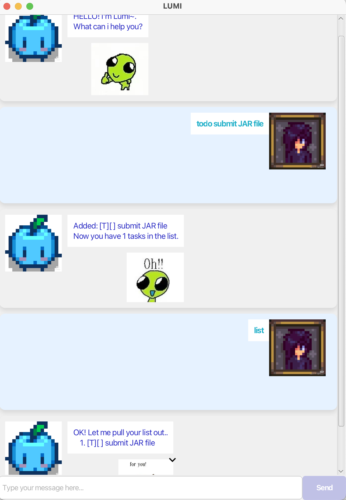

# LUMI User Guide
## An intelligent cute task manager
### 📌 Introduction
Lumi is a chatbot that helps you manage tasks effortlessly.
It supports todos, deadlines, events, searching, etc. 
Enjoy an interactive chat with LUMI !



### 🚀 Getting Started
Prerequisites: 
* JDK 17
* Ensure Java 17 or later is installed.
* download the latest JAR file

run `java -jar Lumi.jar`
### Basic Commands
1. Add tasks (todo, deadline, event)
3. List tasks (list)
5. Mark/Unmark tasks (mark, unmark)
7. Delete tasks (delete)
9. Find tasks (find)
11. Tag tasks (tag)
13. Clear all tasks (clear)
15. Exit (bye)

## 📝 Adding Tasks
### 1️⃣Adding a deadlines
#### _Adds a task with a due date_.

usage: `deadline <task description> /by <YYYY-MM-DD>`

example: `deadline create JAR /by 2025-02-21` 

Lumi should mark [D] for your task

```
Added: [D][ ] create JAR (by: Feb 21 2025)
Now you have 1 tasks in the list.
```

### 2️⃣Adding a Todo
#### _Creates a simple task without a date_.

usage: `todo <task description>`

example: `todo create JAR`

Lumi should mark [T] for your task

```
Added: [T][ ] create JAR (by: Feb 21 2025)
Now you have 1 tasks in the list.
```


### 3️⃣ Adding an Event
#### _Creates a task with a start and end date._

usage: `event <task description> /from <YYYY-MM-DD> /to <YYYY-MM-DD>`

example: `event party /from 2025-07-01 /to 2025-07-02`

Lumi should mark [E] for your task

```
Added: [E][ ] party (from: Jul 01 2025 to: Jul 02 2025)
Now you have 1 tasks in the list.
```

## 📜 Viewing Tasks
### 🗂️ List All Tasks
#### _Displays all tasks currently in Lumi._

usage:`list`

example: `list`

Lumi shoud list down all the tasks in your tasklist

```
OK! Let me pull your list out..
   1. [D][ ] create JAR (by: Feb 21 2025) 
   2. [E][ ] party (from: Jul 01 2025 to: Jul 02 2025)
```

## ✅ Marking & Unmarking Tasks
### ✔ Mark a Task as Done
#### _Marks a task as completed._

usage:`mark <task number>`

example: `mark 1`

Lumi shoud mark your first task as done

```
Nice! I've marked this task as done:
   1. [D][X] create JAR (by: Feb 21 2025) 
  ```
### ❌ Unmark a Task
#### _Marks a completed task as not done._

usage:`unmark <task number>`

example: `unmark 1`

Lumi shoud unmark your first task as not done

```
OK, I've marked this task as not done yet:
   1. [D][] create JAR (by: Feb 21 2025) 
  ```

## 🗑️ Deleting Tasks
### ❌ Delete a Task
#### _Removes a task from the list._

usage:`delete <task number>`

example: `delete 1`

Lumi shoud delete your first task

```
Removed: [D][ ] create JAR (by: Feb 21 2025) 
Now you have 1 tasks left.
  ```
## 🔍 Searching & Tagging
### 🔎 Finding Tasks
#### _Searches for tasks containing a keyword._
usage:`find <keyword>`

example: `find JAR`

Lumi shoud find out the task that contains "JAR"

```
Here are the matching tasks in your list:):
1. [D][] create JAR (by: Feb 21 2025) 
  ```

### 🏷️ Tagging a Task
#### _Tags a task with a custom label._
usage:`tag <task number> #<tag>`

example: `tag 1 #must do`

Lumi shoud tag task 1 as must do

```
Tagged task: [T][ ] create JAR #must do
  ```
## 🧹 Clearing All Tasks
#### _Clears all tasks from Lumi permanently._
usage:`clear`

example: `clear`

Lumi shoud clear all your tasks

```
Got it! Your task list has been cleared!
  ```

# NEXT UP
try bye and hi with lumi, see what does it reply?


